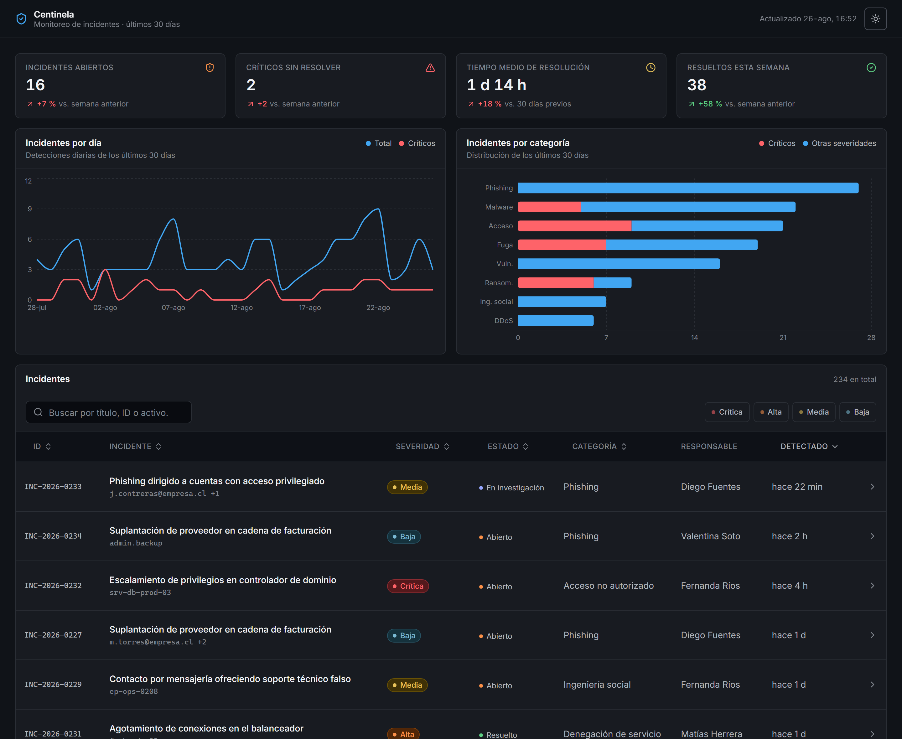
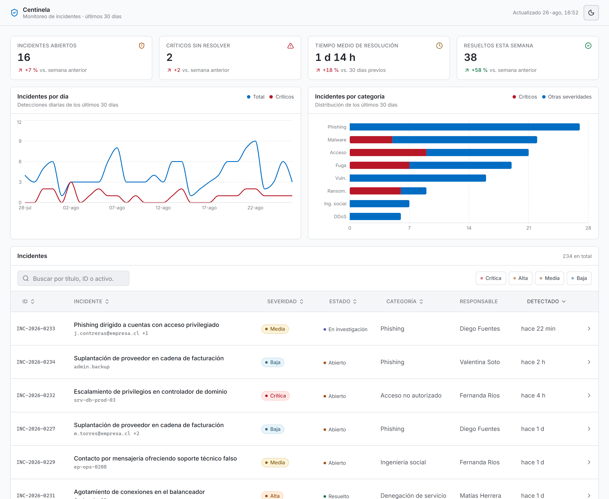
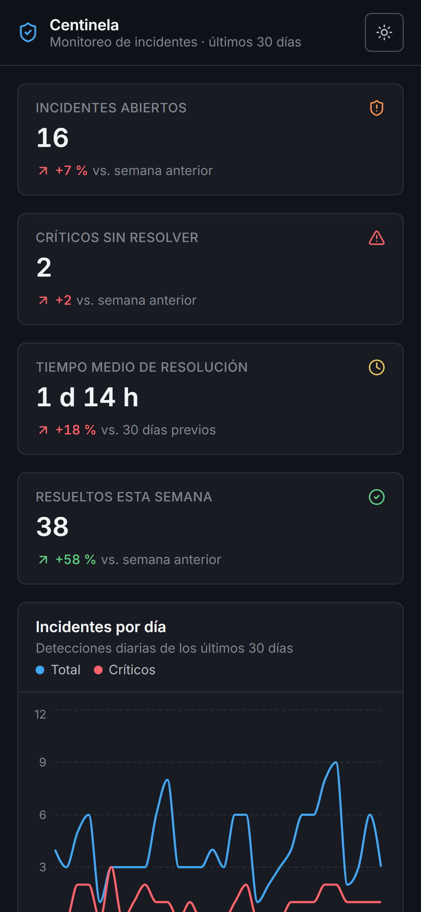
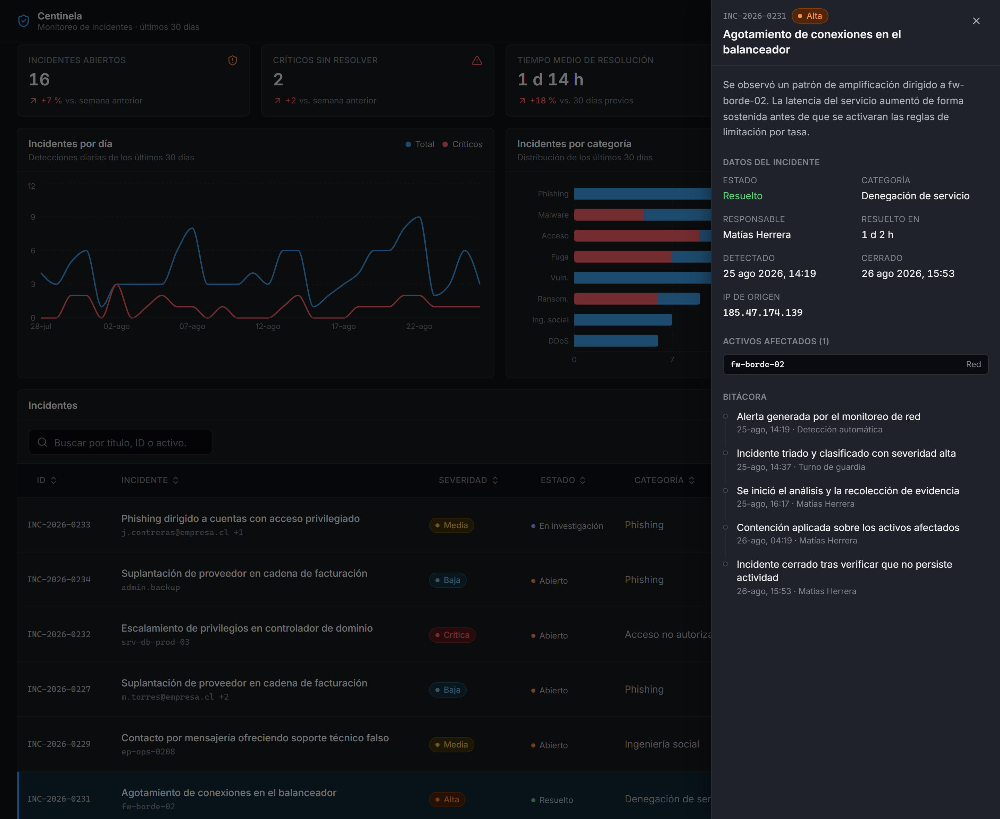
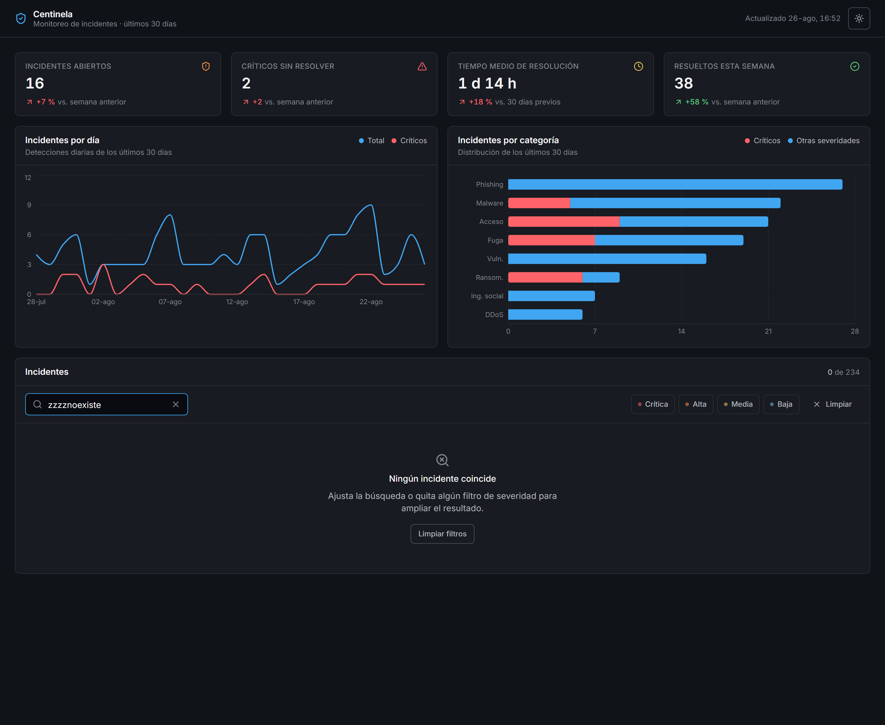

# Centinela

Dashboard de monitoreo de incidentes de ciberseguridad. Una sola pantalla donde
un analista ve el estado del turno: cuánto hay abierto, qué es crítico, cómo
viene la tendencia y qué incidente conviene mirar ahora.

Proyecto de portafolio, sin backend: los datos son un dataset mock generado de
forma determinista.



---

## Stack

| | |
|---|---|
| Build | Vite 8 |
| UI | React 19 + TypeScript 6 |
| Estilos | Tailwind CSS v4 |
| Gráficos | Recharts 3 |
| Íconos | lucide-react |
| Lint | oxlint |
| Verificación de UI | Playwright |

Sin librerías de componentes, sin gestor de estado y sin router: nada de eso
aportaba algo que el proyecto necesitara.

## Cómo correrlo

```bash
npm install
```

```bash
npm run dev
```

Queda en `http://localhost:5173`.

| Comando | Qué hace |
|---|---|
| `npm run dev` | Servidor de desarrollo |
| `npm run build` | Chequeo de tipos + build de producción |
| `npm run preview` | Sirve el build de producción |
| `npm run typecheck` | Sólo TypeScript |
| `npm run lint` | oxlint |
| `npm run verify` | 45 comprobaciones de UI sobre un navegador real |

`npm run verify` necesita el servidor de desarrollo levantado y el navegador de
Playwright instalado:

```bash
npx playwright install chromium
```

Con `npm run verify -- --shots` además regenera las capturas de `docs/`.

## Estructura

```
src/
├─ components/
│  ├─ ui/          Card, Badge, Button, Table, SearchInput, ToggleGroup,
│  │               SidePanel, Pagination, EmptyState — sin nada de dominio
│  ├─ incidents/   MetricsGrid, IncidentsPanel, IncidentsTable,
│  │               IncidentCardList, IncidentDetailPanel, SeverityBadge…
│  ├─ charts/      ChartCard, IncidentsTrendChart, IncidentsByCategoryChart
│  └─ layout/      AppHeader, ThemeToggle
├─ hooks/          useIncidents, useTheme, useMediaQuery
├─ lib/            metrics, filterIncidents, catalog, format, cn
├─ data/           incidents (generador), templates, random
├─ types/          incident, dashboard
└─ index.css       design tokens
```

La regla que ordena todo: **`components/ui` no sabe qué es un incidente**.
Recibe `className` y datos ya formateados. Todo lo que sabe de severidades,
estados y categorías vive en `components/incidents` y en `lib/catalog.ts`.

## Decisiones de diseño

### Los design tokens están en el CSS, no en `tailwind.config.js`

Tailwind v4 eliminó el archivo de configuración: la config *es* el CSS. Los
tokens están en [`src/index.css`](src/index.css), en dos bloques:

- `@theme inline` para los colores, que emite `var(--token)` en lugar de copiar
  el valor. Eso es lo que permite que `bg-surface-raised` cambie de tema sin
  duplicar una sola clase.
- `@theme` para lo que no depende del tema: espaciado (`--spacing-gutter`,
  `--spacing-cell-x`), radios, tipografía y la animación del panel.

No hay un solo color escrito a mano en un componente.

### Oscuro por defecto, sin destello

Los tokens oscuros viven en `:root` y el tema claro es un override con la clase
`.light`. Al revés de lo habitual, y a propósito: sin JavaScript la aplicación
ya se ve como debe verse. Un script mínimo en `index.html` aplica `.light`
antes del primer pintado para quien haya elegido el tema claro.



### La severidad nunca depende sólo del color

Cada severidad se distingue por tres vías: la palabra ("Crítica"), el color de
la píldora y un punto indicador. El estado del ciclo de vida usa un tratamiento
deliberadamente más liviano —punto y texto, sin fondo— para que no compita con
la severidad, que es lo que decide a qué se responde primero.

### La tabla se convierte en una lista real, no en una tabla disfrazada

Bajo 768px se renderiza una `<ul>` de tarjetas; por encima, una `<table>`. Son
dos árboles distintos y sólo uno existe a la vez, decidido por `useMediaQuery`
sobre `matchMedia`.

La alternativa habitual —renderizar ambos y ocultar uno con `hidden md:block`—
deja una `<table>` invisible pero presente, que los lectores de pantalla
anuncian igual. Y una tabla estrechada a 375px o exige desplazamiento lateral o
deja celdas de dos caracteres, con encabezados que dejan de significar algo al
apilarse.



### Las métricas y los gráficos no reaccionan a los filtros

Los filtros son una herramienta de triaje sobre el listado. Si además movieran
los indicadores, sería imposible distinguir "bajaron los incidentes" de
"filtré la vista". Los indicadores siempre describen los últimos 30 días
completos.

### El panel lateral es un `<dialog>` nativo

Con `showModal()` el navegador entrega, y bien, todo lo que habría que
reimplementar: atrapa el foco, cierra con Escape, vuelve el resto de la página
inerte y devuelve el foco al elemento que lo abrió. Lo único que no hace es
bloquear el scroll de fondo, y eso sí se maneja en el componente.



### Cada métrica compara contra su propia línea base

Los conteos de abiertos se comparan contra el estado reconstruido de hace una
semana; los cierres, contra la semana previa; el tiempo de resolución, contra
los 30 días anteriores, que es una muestra lo bastante grande para no oscilar
con dos o tres casos sueltos.

La variación se muestra en porcentaje, pero cuando la base es cero —que con los
críticos sin resolver pasa seguido— cae a la diferencia absoluta. Un porcentaje
sobre una base de dos casos es ruido, no información.

Que una variación sea buena o mala tampoco lo decide el signo: que suban los
incidentes abiertos es malo, que suban los resueltos es bueno. Cada tarjeta
declara su `higherIsBetter`.

### Estado vacío con salida



## Accesibilidad

- HTML semántico: `header`, `main`, `table`/`th`/`caption`, `ul`/`li`,
  `dl`/`dt`/`dd`, `ol` para la bitácora, y un solo `h1`.
- **Teclado en la tabla**: el control accesible de cada fila es un `<button>`
  real, no una `<tr>` con `tabIndex`. Una fila con `tabIndex` recibe el foco
  pero no se anuncia como accionable. Enter y Espacio abren el detalle; ↑ y ↓
  recorren las filas; Home y End van a los extremos.
- `aria-sort` en los encabezados ordenables, `aria-pressed` en los filtros de
  severidad, `aria-current` en la fila abierta.
- Los recuentos de resultados y de página son `role="status"`: cambian lejos
  del control que los provoca.
- Foco visible en toda la aplicación, con `outline-offset` para que se lea
  también sobre fondos claros.
- Enlace "Saltar al contenido" como primer elemento tabulable.
- La animación del panel va bajo `motion-safe`, y hay un bloque
  `prefers-reduced-motion` global.
- Los gráficos de Recharts son tabulables por su capa de accesibilidad, así que
  llevan `aria-label` propio; sin él anunciarían la concatenación de los ejes.

## Los datos

`src/data/incidents.ts` genera unos 230 incidentes con un PRNG de semilla fija
(mulberry32): el dataset es idéntico en cada carga y en cada máquina. El total
varía un poco según el día de la semana, porque los fines de semana registran
menos detecciones.

Cubre 60 días aunque el dashboard muestre 30. Los otros 30 hacen falta para
calcular las variaciones contra el período anterior en lugar de inventarlas.

Un detalle que costó afinar: la probabilidad de que un incidente siga abierto
es **fija** (7%), no una función de su antigüedad. Modelada como función de la
antigüedad, el stock de abiertos parecía crecer siempre —los recientes tenían
mucha probabilidad de seguir abiertos y los de hace una semana ya estaban todos
cerrados— y las variaciones semanales salían infladas por construcción, del
orden de +100%. Con una tasa fija el modelo es estacionario y los cambios
reflejan sólo el flujo real de entradas y cierres.

## Tipado

`strict` (ya es el default en TypeScript 6) más `noUncheckedIndexedAccess`,
`exactOptionalPropertyTypes` y `noImplicitOverride`. Sin `any` y sin
aserciones de tipo en todo el proyecto.

Los identificadores del código están en inglés (`severity`, `critical`) y el
texto visible en español. Las etiquetas viven sólo en `lib/catalog.ts`, así la
capa de datos es agnóstica del idioma.

## Rendimiento

El build separa las dependencias en tres chunks para que el navegador conserve
en caché lo que no cambia entre despliegues:

```
index    48 kB  │ gzip:  15 kB   ← la aplicación
react   190 kB  │ gzip:  60 kB
vendor  378 kB  │ gzip: 109 kB   ← Recharts y sus dependencias
```

## Deploy en Vercel

Vercel detecta Vite automáticamente. Sin variables de entorno ni configuración
adicional:

```bash
npx vercel
```

O desde la interfaz: importar el repositorio y aceptar los valores detectados
(`npm run build`, salida en `dist`).
