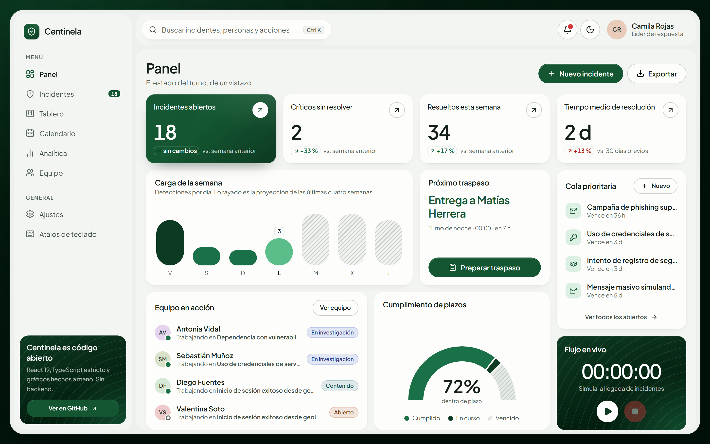
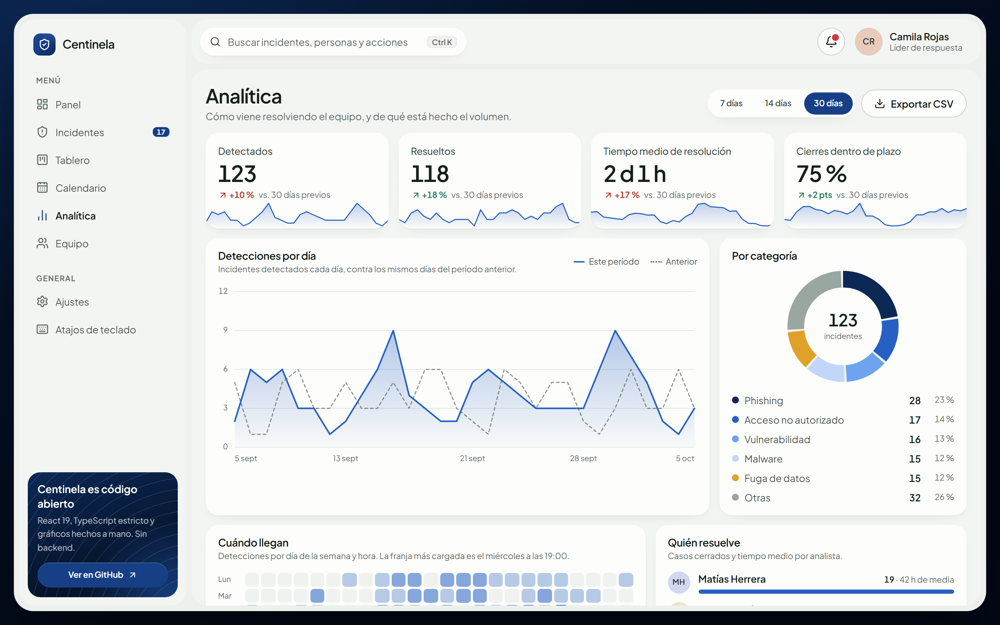
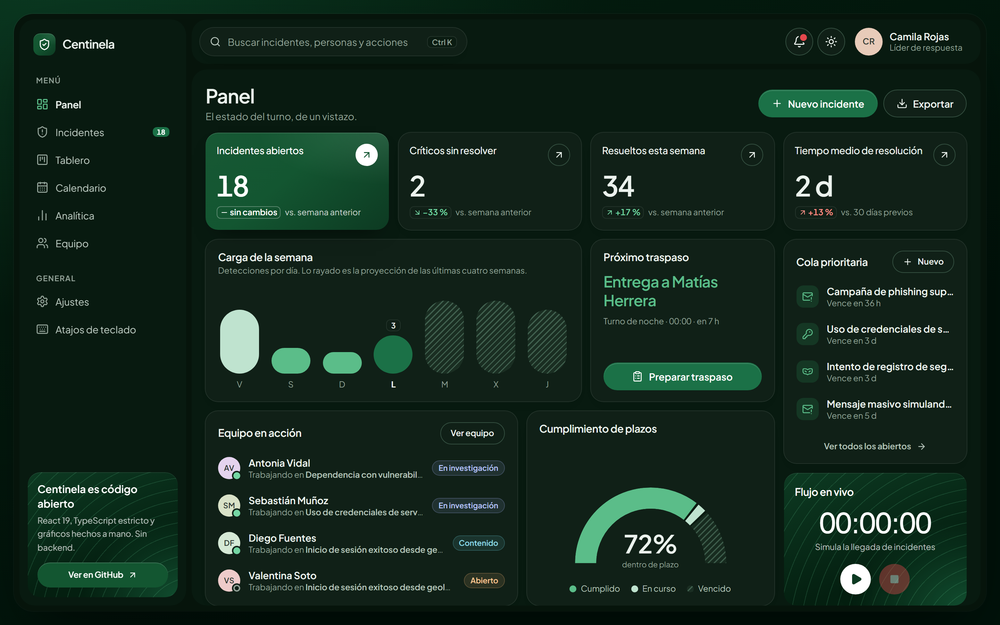
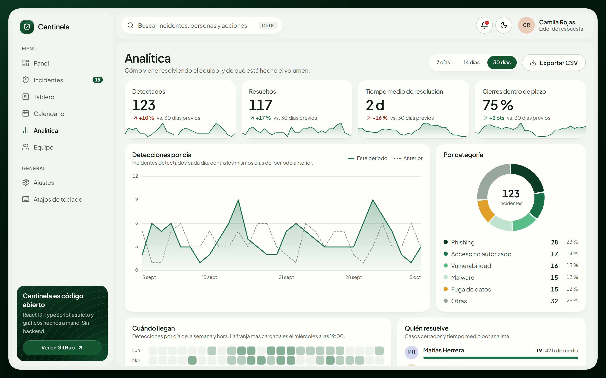
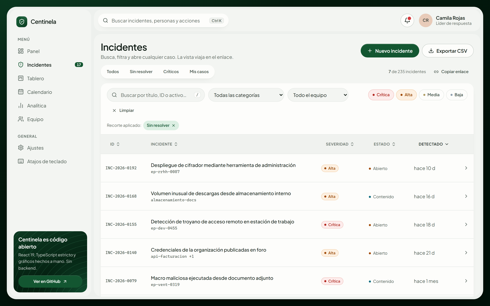
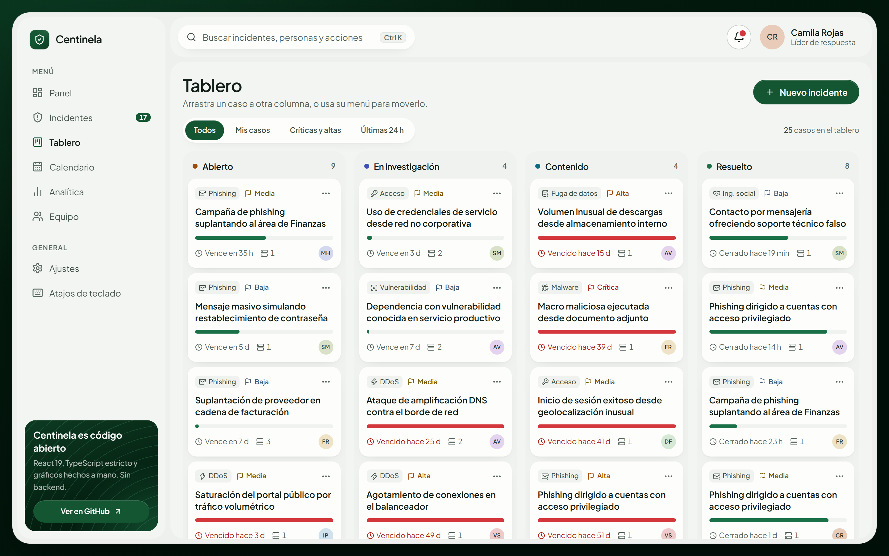
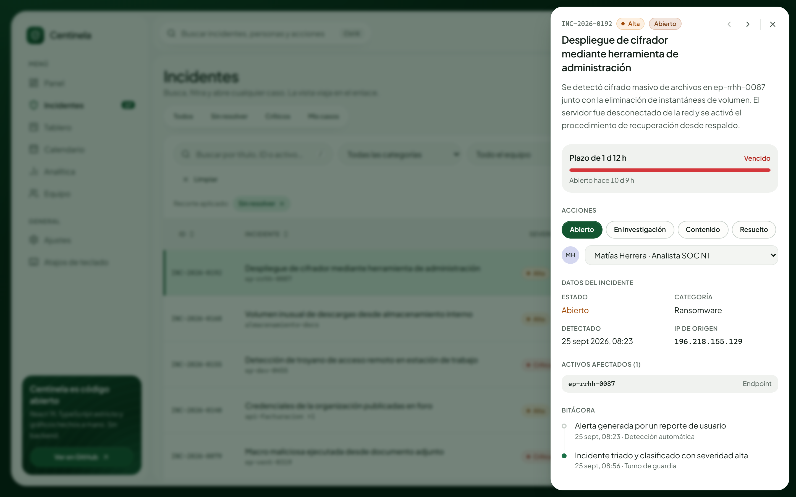
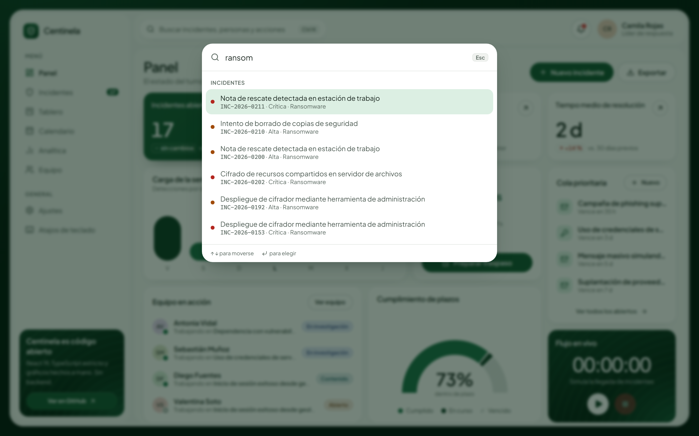
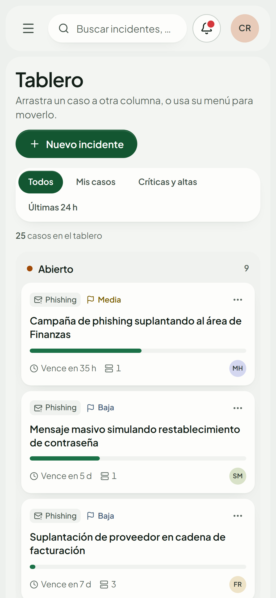

# Centinela

Consola de operaciones de seguridad. Siete vistas sobre un mismo conjunto de
incidentes: un panel bento con el estado del turno, la tabla de triaje, un
tablero kanban, el calendario operativo, la analítica, el equipo y los ajustes.

Proyecto de portafolio, sin backend: los datos son un dataset mock generado de
forma determinista, y todo lo que se cambia vive en memoria.

**[Ver la demo →](https://centinela-rho.vercel.app)**



---

## Qué hace

| Vista | Para qué |
|---|---|
| **Panel** | Indicadores, carga de la semana con proyección, próximo traspaso de turno, equipo en acción, cumplimiento de plazos, cola prioritaria y el control del flujo en vivo |
| **Incidentes** | Tabla con búsqueda sin acentos, filtros, orden, paginación y exportación a CSV. Toda la vista viaja en la URL |
| **Tablero** | Kanban por estado. Las tarjetas se arrastran, o se mueven desde su menú |
| **Calendario** | Agenda del equipo —comités, mantenimientos, simulacros, vencimientos— cruzada con los incidentes de cada día |
| **Analítica** | Ventana de 7, 14 o 30 días contra la anterior: detecciones, reparto por categoría y severidad, mapa de calor por hora y quién resuelve |
| **Equipo** | Carga de cada analista, filtro por célula y perfil con sus casos |
| **Ajustes** | Con qué analista se usa la consola, avisos, tema, acento y primer día de la semana |

Y por encima de todas: paleta de comandos (`Ctrl K` / `⌘K`), panel de detalle
con cambio de estado y reasignación, registro manual de incidentes, informe de
traspaso de turno, avisos con "Deshacer" y atajos de teclado (`?` los lista).

## Stack

| | |
|---|---|
| Build | Vite 8 |
| UI | React 19 + TypeScript 6 |
| Estilos | Tailwind CSS v4 |
| Gráficos | SVG y CSS escritos a mano |
| Íconos | lucide-react |
| Lint | oxlint |
| Verificación de UI | Playwright |

Sin librería de componentes, sin gestor de estado, sin router y sin librería de
gráficos: nada de eso aportaba algo que el proyecto necesitara.

## Cómo correrlo

```bash
npm install
```

```bash
npm run dev
```

Queda en `http://localhost:5173`.

| Comando | Qué hace |
|---|---|
| `npm run dev` | Servidor de desarrollo |
| `npm run build` | Chequeo de tipos + build de producción |
| `npm run preview` | Sirve el build de producción |
| `npm run typecheck` | Sólo TypeScript |
| `npm run lint` | oxlint |
| `npm run verify` | 126 comprobaciones de UI sobre un navegador real |

`npm run verify` necesita el servidor de desarrollo levantado y el navegador de
Playwright instalado:

```bash
npx playwright install chromium
```

Con `npm run verify -- --shots` además regenera las capturas de `docs/`, y con
`BASE_URL` apunta a cualquier despliegue:

```bash
BASE_URL=https://centinela-rho.vercel.app npm run verify
```

## Estructura

```
src/
├─ components/
│  ├─ ui/          Button, Card, Modal, SidePanel, Menu, Toaster, Table,
│  │               PillGroup, Avatar, Switch… — sin nada de dominio
│  ├─ charts/      CapsuleBars, Gauge, Donut, AreaCompare, Heatmap
│  ├─ layout/      Sidebar, Topbar, CommandPalette, NotificationsMenu
│  ├─ incidents/   tabla, tarjetas, filtros, panel de detalle, badges
│  ├─ panel/       StatCard, LiveCard
│  ├─ dialogs/     nuevo incidente, traspaso de turno, atajos
│  └─ views/       una por ruta
├─ hooks/          useIncidents, useStore, useFlip, useNow, useCountUp…
├─ lib/            metrics, analytics, sla, handoff, router, urlState,
│                  filterIncidents, csv, catalog, format
├─ data/           incidents (generador), store, settings, toasts, team,
│                  calendar
├─ types/          incident, dashboard, app
└─ index.css       design tokens
```

Dos reglas ordenan todo:

- **`components/ui` no sabe qué es un incidente.** Recibe `className` y datos ya
  formateados. Lo que sabe de severidades, estados y categorías vive en
  `components/incidents` y en `lib/catalog.ts`.
- **Las vistas no conocen los almacenes ni el enrutador.** Reciben datos y un
  conjunto de acciones (`types/app.ts`). Por eso el panel, el tablero y el
  calendario abren el mismo detalle o saltan a la misma tabla filtrada sin
  importar nada unos de otros.

## Decisiones de diseño

### Una ventana clara sobre verde bosque

El lenguaje visual —la ventana flotante, el bento, las cápsulas, el rayado—
parte de una referencia de tablero bento, y la paleta está muestreada de ahí:
el verde `#135631` de los botones, los tres tonos de las series, el fondo que
va de `#0b3a22` al negro. Lo que es de Centinela es todo lo demás: qué va en
cada baldosa y por qué.

Los tokens viven en [`src/index.css`](src/index.css). Tailwind v4 eliminó el
archivo de configuración —la config *es* el CSS— así que están en dos bloques:
`@theme inline`, que emite `var(--token)` en vez de copiar el valor, y `@theme`
para lo que no depende del tema. No hay un solo color escrito a mano en un
componente.

### El acento es una dimensión aparte del tema

`data-accent` en `<html>` reemplaza la escala `--brand-*` y todo lo que deriva
de ella —botones, series, fondo, patrones— se re-tiñe sin tocar un componente.
Bosque, Océano, Ciruela y Brasa, combinables con claro y oscuro.



Lo que **no** se re-tiñe es la severidad y el estado: son semánticos. Un
crítico es rojo con cualquier acento.

En oscuro las superficies se mezclan desde la marca con `color-mix`, para que
el re-teñido también llegue ahí en vez de dejar un negro verdoso fijo debajo
de un acento azul. Y la jerarquía de las series se invierte: la más pesada
pasa a ser la más clara, porque el verde casi negro se perdería contra la
tarjeta.



### El color con significado es de la severidad y del estado

Las categorías, las células y los turnos no llevan tono propio; se distinguen
por icono y por palabra. Si cada dimensión tuviera su color, ninguno
significaría nada. Y la severidad nunca depende sólo del color: lleva la
palabra, el tono y un punto.

### El rayado significa siempre lo mismo

"Esto todavía no es un dato firme": proyección en las barras de carga, plazo
vencido en el medidor. Se distingue por forma y no sólo por color, así que
sobrevive a una impresión en grises.

Las barras de carga muestran cuatro días reales y tres proyectados —la media
de ese día de la semana en las cuatro semanas previas—. Es una ventana móvil
centrada en hoy y no la semana natural, porque un lunes la semana natural
sería un dato y seis proyecciones.

### Una sola definición de urgencia

La cola del panel, el tablero, la campana y el traspaso ordenan igual: primero
el plazo que vence antes. La severidad no hace falta como criterio aparte
porque ya está dentro del plazo —un crítico tiene doce horas y un caso de
severidad baja, una semana—.

Lo ya vencido va después. Un caso que lleva un mes fuera de plazo no se
arregla en este turno; el que vence en dos horas todavía se puede salvar, y
ése es el que hay que mirar ahora.

### Los gráficos están dibujados a mano

Cápsulas, medidor, anillo, área con período anterior y mapa de calor: SVG y
CSS. La librería de gráficos que había pesaba 111 kB comprimidos, más que la
aplicación entera, y ninguno de estos necesita más que arcos, rectángulos y
una polilínea.

Dos detalles que hacen la diferencia:

- **El medidor redondea sus extremos con una máscara**, no redondeando cada
  tramo: redondear cada uno dejaría medias lunas en las juntas interiores. Esa
  misma máscara es la que se anima, y el medidor se "dibuja" de izquierda a
  derecha.
- **El área se dibuja en píxeles reales**, con el ancho de un `ResizeObserver`,
  en vez de estirar un `viewBox`: estirar deforma el texto de los ejes.



### El estado vive en la URL

Filtros, búsqueda, orden, página e incidente abierto se serializan en la barra
de direcciones:

```
/incidentes?sev=critical,high&estado=open,investigating&inc=INC-2026-0231
```

Un analista pega el enlace de "críticos sin resolver" en el chat del turno, y
recargar durante un incidente no puede costarle el contexto.

- **Todo va con `replaceState` menos abrir el panel**, que va con `pushState`:
  teclear en la búsqueda no deja una entrada por letra, pero "atrás" cierra el
  panel.
- **Todo lo que llega por la URL se valida contra el dominio.**
  `?sev=inventada&p=-5` cae a los valores por defecto.
- **Los filtros sólo se serializan en la vista de incidentes.** En el tablero
  no filtrarían nada, y un enlace al tablero no debe arrastrar un `?sev=…` sin
  efecto. Siguen en memoria, y al volver a la tabla se reponen en la URL.
- **El incidente abierto se serializa siempre**, porque su panel se abre sobre
  cualquier vista: `/tablero?inc=…` es un enlace válido.
- **Los enlaces de antes siguen funcionando.** Cuando la tabla era toda la app,
  `/?sev=critical` apuntaba a ella; hoy se reescribe a `/incidentes?sev=critical`
  antes del primer render.



### El enrutador es un archivo

Siete rutas fijas no justifican una librería: hace falta leer `pathname`,
escribirlo con `pushState` y avisar a quien esté suscrito. Es un almacén
externo más, consumido con `useSyncExternalStore`, igual que los incidentes,
los ajustes y los avisos.

Al cambiar de vista no hay recarga que anuncie nada, así que se hacen a mano
los tres avisos que una navegación tradicional daba gratis: el título de la
pestaña, el scroll al inicio y el foco en el `h1` nuevo.

### Arrastrar es el atajo, no la vía

En el tablero, arrastrar una tarjeta cambia su estado. Pero el arrastre no
funciona con teclado ni en una pantalla táctil, así que cada tarjeta tiene
además un menú "Mover a…" que hace lo mismo. Todo lo que se puede hacer
arrastrando se puede hacer sin arrastrar.

Cuando una tarjeta cambia de columna no se teletransporta: un FLIP escrito a
mano (`useFlip`, sobre la Web Animations API) mide dónde estaba y dónde quedó
y anima el trayecto. Es lo que deja ver *qué* se movió cuando el cambio lo
provoca el menú. El mismo hook reacomoda las tarjetas del equipo al filtrar.



### Los diálogos son `<dialog>` nativos

Panel de detalle, modales, paleta y cajón móvil. Con `showModal()` el
navegador entrega, y bien, todo lo que habría que reimplementar: atrapa el
foco, cierra con Escape, vuelve inerte el resto de la página y devuelve el
foco a quien lo abrió.

Eso tiene una consecuencia que no se ve venir: un aviso montado en `body`
queda **debajo** del telón de un diálogo modal, atenuado e inerte, y su botón
"Deshacer" no se puede pulsar — justo cuando se acaba de cambiar un estado
desde el panel. Ningún `z-index` lo arregla; lo único que está por encima de
un diálogo modal es su propio contenido. Así que los avisos se montan, con un
portal, dentro del diálogo abierto.



### "Deshacer" repone la instantánea, no aplica el cambio inverso

Reabrir por error un caso resuelto y deshacerlo tiene que devolverle su fecha
de cierre original. El cambio inverso —"resolver"— lo cerraría *ahora*, y
movería el tiempo medio de resolución por un clic equivocado.

### La paleta de comandos no mueve el foco

Sigue el patrón de combobox de ARIA: el foco no sale nunca del campo, y las
flechas mueven una opción activa que se comunica con `aria-activedescendant`.
Mover el foco real a cada opción obligaría a volver al campo para seguir
escribiendo.



### Modo en vivo

La tarjeta con forma de cronómetro hace entrar incidentes cada pocos segundos.
Los genera la misma función que creó el histórico, así que lo que entra se
parece a lo que ya está en la tabla.

**Arranca detenido a propósito.** El dataset base es determinista y de él
dependen las capturas y las comprobaciones; si el flujo empezara solo, ninguna
de las dos cosas sería reproducible.

Los avisos flotantes son **sólo para lo crítico**. Un aviso por cada incidente
convierte el pie de la pantalla en una cascada que se aprende a ignorar en
treinta segundos.

### El movimiento se puede apagar entero

Todo lo que se mueve está bajo `motion-safe` o dentro del bloque global de
`prefers-reduced-motion`. Lo que anima JavaScript —el contador de los
indicadores, el FLIP— consulta la preferencia y entrega el estado final
directamente.

### La tabla se convierte en una lista real

Bajo 768px se renderiza una `<ul>` de tarjetas; por encima, una `<table>`. Son
dos árboles distintos y sólo uno existe a la vez. La alternativa habitual
—renderizar ambos y ocultar uno con CSS— deja una `<table>` invisible pero
presente, que los lectores de pantalla anuncian igual.

 

## Accesibilidad

- HTML semántico: `nav`, `main`, `table`/`th`/`caption`, `dl`/`dt`/`dd`, `ol`
  para la bitácora, y un solo `h1` por vista.
- La navegación son `<a href>` reales con `aria-current="page"`: el clic
  central y "abrir en pestaña nueva" funcionan.
- **El calendario es una `<table>`** con un `<th>` por día de la semana. Un
  calendario *es* una tabla, y marcarlo como tal es lo que deja a un lector de
  pantalla anunciar "miércoles" al entrar en una celda.
- **Cada gráfico tiene alternativa**: nombre accesible con el resumen, y el
  área lleva además una tabla sólo para lectores de pantalla. Con teclado, las
  flechas recorren sus días y una región `aria-live` los anuncia.
- Los ajustes son pestañas de verdad (`tablist` / `tab` / `tabpanel`), con las
  flechas recorriéndolas. Las píldoras del resto de la app son botones con
  `aria-pressed`, porque recortan el mismo contenido en vez de cambiar de panel.
- Menú del tablero con el patrón de botón de menú: flechas, `Home`/`End`,
  Escape devuelve el foco al disparador.
- **El contraste se mide, no se estima.** La suite pinta cada color resuelto
  —varios salen de `color-mix`— en un canvas de un píxel y calcula la razón
  real, en los dos temas y los cuatro acentos: 29 pares por combinación, todos
  sobre 4.5:1. Peor caso actual: 4.77:1.
- Los atajos de una sola tecla no se disparan mientras se escribe, ni con un
  diálogo abierto.
- Enlace "Saltar al contenido" como primer elemento tabulable.

## Los datos

`src/data/incidents.ts` genera unos 235 incidentes con un PRNG de semilla fija
(mulberry32): el dataset es idéntico en cada carga y en cada máquina. Cubre 60
días aunque el panel muestre 30; los otros 30 hacen falta para calcular las
variaciones contra el período anterior en lugar de inventarlas.

La probabilidad de que un incidente quede estancado es **fija** (7 %), no una
función de su antigüedad. Modelada como función de la antigüedad, el stock de
abiertos parecía crecer siempre y las variaciones semanales salían infladas
por construcción.

El plazo de resolución es una propiedad de la severidad —12 h, 36 h, 3 d,
7 d—, no del incidente, así que no se guarda: se calcula al mirar, como el
resto de las métricas.

La agenda del calendario no usa semilla. Sale de reglas —"todos los lunes",
"el segundo martes", "el último día hábil"—, que es como se agenda de verdad
la operación de un SOC, y hace que cualquier mes tenga agenda sin generar
nada por adelantado.

El CSV exportado antepone el BOM de UTF-8, para que Excel no convierta
"Crítica" en "Crítica", y fuerza a texto las celdas que empiezan por `=`, `+`,
`-` o `@`: los títulos son texto libre y una hoja de cálculo los ejecutaría
como fórmulas.

## Tipado

`strict` más `noUncheckedIndexedAccess`, `exactOptionalPropertyTypes` y
`noImplicitOverride`. Sin `any` en todo el proyecto.

Hay **una** aserción de tipo, en `lib/cssVars.ts`: `CSSProperties` de React
sólo declara propiedades conocidas, así que pasar `--rise-delay` como estilo en
línea no tiene forma de tipificarse. Está aislada en una función de tres
líneas cuya firma exige el prefijo `--`.

Los identificadores del código están en inglés (`severity`, `critical`) y el
texto visible en español. Las etiquetas viven sólo en `lib/catalog.ts`.

## Rendimiento

```
index    175 kB  │ gzip:  49 kB   ← la aplicación, con sus siete vistas
react    190 kB  │ gzip:  60 kB
vendor    13 kB  │ gzip:   5 kB   ← iconos
css       56 kB  │ gzip:  11 kB
```

Unos 125 kB comprimidos en total. La versión anterior, con una sola pantalla y
una librería de gráficos, pesaba 201 kB.

## Deploy en Vercel

Vercel detecta Vite automáticamente. [`vercel.json`](vercel.json) sólo añade
la reescritura que una SPA con rutas necesita: cualquier ruta que no sea un
archivo se sirve con `index.html`, para que recargar en `/tablero` no dé 404.
