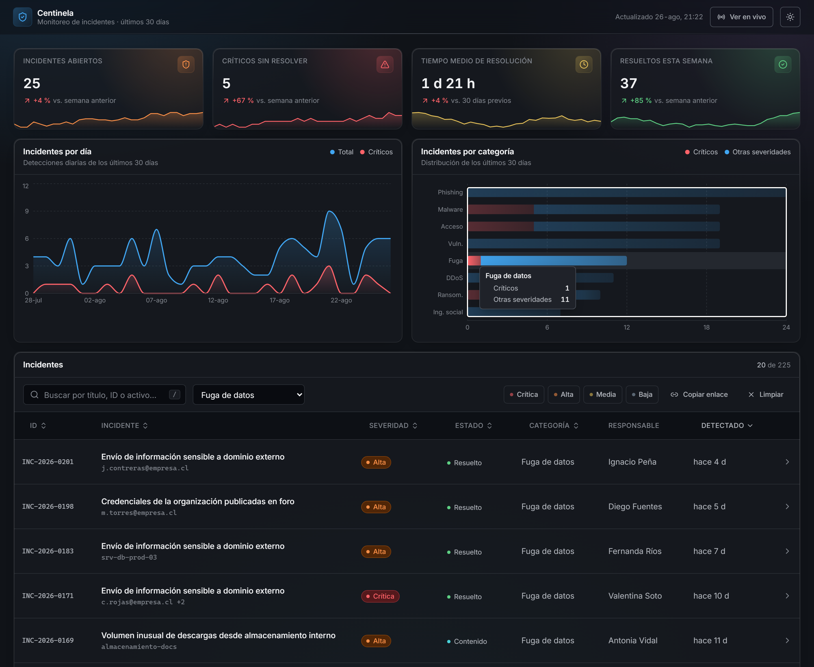
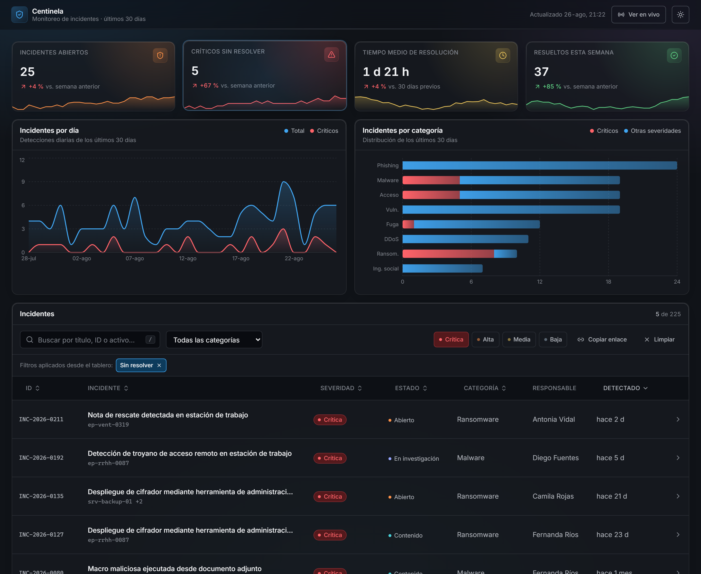

# Centinela

Dashboard de monitoreo de incidentes de ciberseguridad. Una sola pantalla donde
un analista ve el estado del turno: cuánto hay abierto, qué es crítico, cómo
viene la tendencia y qué incidente conviene mirar ahora.

Proyecto de portafolio, sin backend: los datos son un dataset mock generado de
forma determinista.

**[Ver la demo →](https://centinela-rho.vercel.app)**


---

## Stack

| | |
|---|---|
| Build | Vite 8 |
| UI | React 19 + TypeScript 6 |
| Estilos | Tailwind CSS v4 |
| Gráficos | Recharts 3 |
| Íconos | lucide-react |
| Lint | oxlint |
| Verificación de UI | Playwright |

Sin librerías de componentes, sin gestor de estado y sin router: nada de eso
aportaba algo que el proyecto necesitara.

## Cómo correrlo

```bash
npm install
```

```bash
npm run dev
```

Queda en `http://localhost:5173`.

| Comando | Qué hace |
|---|---|
| `npm run dev` | Servidor de desarrollo |
| `npm run build` | Chequeo de tipos + build de producción |
| `npm run preview` | Sirve el build de producción |
| `npm run typecheck` | Sólo TypeScript |
| `npm run lint` | oxlint |
| `npm run verify` | 74 comprobaciones de UI sobre un navegador real |

`npm run verify` necesita el servidor de desarrollo levantado y el navegador de
Playwright instalado:

```bash
npx playwright install chromium
```

Con `npm run verify -- --shots` además regenera las capturas de `docs/`, y con
`BASE_URL` apunta a cualquier despliegue:

```bash
BASE_URL=https://centinela-rho.vercel.app npm run verify
```

## Estructura

```
src/
├─ components/
│  ├─ ui/          Card, Badge, Button, Table, SearchInput, ToggleGroup,
│  │               SidePanel, Pagination, EmptyState — sin nada de dominio
│  ├─ incidents/   MetricsGrid, IncidentsPanel, IncidentsTable,
│  │               IncidentCardList, IncidentDetailPanel, SeverityBadge…
│  ├─ charts/      ChartCard, IncidentsTrendChart, IncidentsByCategoryChart
│  └─ layout/      AppHeader, ThemeToggle
├─ hooks/          useIncidents, useTheme, useMediaQuery, useLiveFeed
├─ lib/            metrics, filterIncidents, urlState, catalog, format, cn
├─ data/           incidents (generador), liveFeed, templates, random
├─ types/          incident, dashboard
└─ index.css       design tokens
```

La regla que ordena todo: **`components/ui` no sabe qué es un incidente**.
Recibe `className` y datos ya formateados. Todo lo que sabe de severidades,
estados y categorías vive en `components/incidents` y en `lib/catalog.ts`.

## Decisiones de diseño

### Los design tokens están en el CSS, no en `tailwind.config.js`

Tailwind v4 eliminó el archivo de configuración: la config *es* el CSS. Los
tokens están en [`src/index.css`](src/index.css), en dos bloques:

- `@theme inline` para los colores, que emite `var(--token)` en lugar de copiar
  el valor. Eso es lo que permite que `bg-surface-raised` cambie de tema sin
  duplicar una sola clase.
- `@theme` para lo que no depende del tema: espaciado (`--spacing-gutter`,
  `--spacing-cell-x`), radios, tipografía y la animación del panel.

No hay un solo color escrito a mano en un componente.

### El vidrio y la luz salen de tokens, no de valores sueltos

Las superficies son translúcidas con desenfoque de lo que hay detrás, y detrás
hay tres focos de luz fijos —`--ambient-1..3`— anclados al viewport. Si el
fondo scrollease, el degradado se leería como contenido en movimiento en vez de
como iluminación de la escena.

El detalle que más cambia la percepción es el más pequeño: un filo de 1px en el
borde superior de cada tarjeta, con degradado, que simula la luz cayendo desde
arriba. Se dibuja con una máscara que vacía el relleno y deja sólo el contorno,
porque así el degradado sigue el radio de las esquinas en lugar de cortarse en
recto.

Los degradados están **atados a un significado**, no puestos por decorar: el
halo de cada indicador lleva el color de lo que mide, el relleno bajo las áreas
se desvanece para que dos series superpuestas no formen un bloque opaco, y el
de las barras da al extremo un borde suave que evita que ocho longitudes
distintas se lean como un macizo de color. La regla que los mantiene a raya es
esa: si un degradado no comunica nada, no entra.

### Oscuro por defecto, sin destello

Los tokens oscuros viven en `:root` y el tema claro es un override con la clase
`.light`. Al revés de lo habitual, y a propósito: sin JavaScript la aplicación
ya se ve como debe verse. Un script mínimo en `index.html` aplica `.light`
antes del primer pintado para quien haya elegido el tema claro.


### El contraste se mide, no se estima

El tema claro se había derivado del oscuro por simetría, y ahí se coló un fallo
que no se ve mirando: `--text-muted` quedaba en **3.76:1** sobre la cabecera de
la tabla, por debajo del 4.5:1 que pide WCAG AA para texto de 12px. Y ese gris
no está en adornos — son los encabezados de columna, las marcas de tiempo y la
comparación de cada indicador.

Ahora se mide en el navegador dentro de la suite de verificación, con los
colores ya resueltos, en ambos temas. La paleta está escrita en `oklch` y
`getComputedStyle` la devuelve sin convertir, así que la conversión a sRGB se
delega en el propio navegador pintando el color en un canvas de un píxel: la
alternativa era reimplementar la conversión a mano y equivocarse en ella.

### La severidad nunca depende sólo del color

Cada severidad se distingue por tres vías: la palabra ("Crítica"), el color de
la píldora y un punto indicador. El estado del ciclo de vida usa un tratamiento
deliberadamente más liviano —punto y texto, sin fondo— para que no compita con
la severidad, que es lo que decide a qué se responde primero.

### La tabla se convierte en una lista real, no en una tabla disfrazada

Bajo 768px se renderiza una `<ul>` de tarjetas; por encima, una `<table>`. Son
dos árboles distintos y sólo uno existe a la vez, decidido por `useMediaQuery`
sobre `matchMedia`.

La alternativa habitual —renderizar ambos y ocultar uno con `hidden md:block`—
deja una `<table>` invisible pero presente, que los lectores de pantalla
anuncian igual. Y una tabla estrechada a 375px o exige desplazamiento lateral o
deja celdas de dos caracteres, con encabezados que dejan de significar algo al
apilarse.


### El estado vive en la URL

Filtros, búsqueda, orden, página e incidente abierto se serializan en la barra
de direcciones, y `popstate` los vuelve a leer:

```
?sev=critical,high&cat=ransomware&orden=severity:desc&inc=INC-2026-0231
```

En una herramienta de monitoreo eso no es un adorno. Un analista pega el enlace
de "críticos sin resolver de ransomware" en el chat del turno, y recargar
durante un incidente no puede costarle el contexto.

Dos detalles que hacen la diferencia entre implementarlo y hacerlo bien:

- **Todo va con `replaceState` menos abrir el panel**, que va con `pushState`.
  Así teclear en la búsqueda no deja una entrada de historial por letra, pero
  el botón "atrás" del navegador cierra el panel, que es lo que la gente
  espera. Si se llegó directo con `?inc=…` no hay a dónde volver, y entonces
  cerrar reemplaza la entrada en lugar de sacar al usuario del sitio.
- **Todo lo que llega por la URL se valida contra el dominio.** La barra de
  direcciones es editable: `?sev=inventada&p=-5` se descarta y cae a los
  valores por defecto, en vez de propagar un tipo mentiroso a la aplicación.

Como todo eso es invisible para quien abre el tablero por primera vez, hay un
botón **"Copiar enlace"** junto a los filtros. Sin él, nadie tiene motivo para
mirar la barra de direcciones y descubrir que la vista se puede compartir.

### Filtrar desde los gráficos

Un clic en una barra filtra la tabla por esa categoría; un clic en un punto de
la línea la filtra por ese día, marcado con una línea de referencia. Volver a
pulsar deselecciona.



El flujo va **sólo en esa dirección**: el gráfico emite el filtro y nunca lo
recibe. Los indicadores y ambos gráficos siempre describen los últimos 30 días
completos, porque si también se recortaran sería imposible distinguir "bajaron
los incidentes" de "filtré la vista".

Hay un matiz de accesibilidad que obligó a rediseñar: **no se puede pulsar una
barra con el teclado**. Si el gráfico fuera la única vía para filtrar por
categoría, ese filtro sería inalcanzable sin ratón. Por eso la categoría tiene
además un `<select>` nativo en la barra de filtros —llega por Tab, se abre con
el teclado, lo anuncian los lectores de pantalla— y por eso es de selección
única: así el gráfico y el selector muestran siempre lo mismo, sin estados
intermedios que reconciliar. La severidad sigue siendo de selección múltiple,
porque filtrar por "crítica y alta" a la vez sí es triaje corriente.

### Los indicadores son el filtro más directo

Pulsar una tarjeta recorta la tabla a lo que esa tarjeta cuenta. Eran la pieza
más visible del tablero y la única inerte: se leía "5 críticos sin resolver" y
no había forma de preguntar cuáles.



Tres cosas que esto obligó a resolver:

- **Hacía falta un filtro por estado**, que no existía. Es de selección
  múltiple porque el caso que importa —"sin resolver"— son tres estados a la
  vez, no uno. No tiene control propio en la barra: se activa desde las
  tarjetas, que son botones y por tanto alcanzables con el teclado, y se quita
  desde su chip.
- **El conjunto reemplaza, no combina.** Pulsar "Críticos sin resolver" lleva
  exactamente a esos, no a esos intersecados con lo que quedara de una búsqueda
  anterior.
- **El tiempo medio de resolución no es un botón.** Es un promedio, no un
  conjunto de incidentes, y su recorte natural —"resueltos"— ya lo abre la
  tarjeta de al lado. Dos botones que llevan al mismo sitio no son un atajo,
  son una duda.

Cada tarjeta lleva además la curva de su propia métrica en los 30 días. Un
"+67 %" da la dirección pero no la forma: no distingue una subida sostenida
durante un mes de un pico de ayer sobre un mes plano. Son la misma cifra y no
significan lo mismo.

### Modo en vivo

Un interruptor en la cabecera hace entrar incidentes cada pocos segundos: la
fila aparece arriba con un realce que se desvanece, el contador de abiertos
sube y el último punto del gráfico se mueve. Los genera la misma función que
creó el histórico, así que lo que entra se parece a lo que ya está en la tabla.

Es un almacén observable fuera de React, consumido con `useSyncExternalStore`
—el intervalo tiene que sobrevivir al montaje y desmontaje de cualquier
componente— y lo difícil no es que los datos cambien, sino que cambien sin
molestar: **el foco del teclado no se mueve**, la página mantiene sus 25 filas
y el scroll no salta. Hay una comprobación dedicada a eso.

**Arranca detenido a propósito.** El dataset base es determinista y de él
dependen las capturas y las comprobaciones; si el flujo empezara solo, ninguna
de las dos cosas sería reproducible. El modo en vivo es una capa opcional sobre
un cimiento que no se mueve.

Con el flujo activo, la fila que entra lo hace con un barrido de luz que corre
una sola vez. Sólo se anima la llegada, no cada repintado: filtrar reordena las
25 filas, y animarlas todas convertiría cada pulsación en un espectáculo.

### Los avisos flotantes son sólo para lo crítico

Y esa restricción es la decisión entera. Un aviso por cada incidente convierte
la esquina de la pantalla en una cascada que se aprende a ignorar en treinta
segundos, y a partir de ahí el aviso no avisa de nada. Limitado a la severidad
que obliga a interrumpir lo que estabas haciendo, que aparezca uno vuelve a
significar algo.

Se anuncian con `role="status"`, que es cortés: espera a que el lector de
pantalla termine la frase en curso. `assertive` interrumpiría a media palabra a
alguien que está leyendo una fila, y el aviso no es una alarma de evacuación —
el incidente ya está en la tabla y en los indicadores; aquí sólo se adelanta.

### El movimiento se puede apagar entero

Todo lo que se mueve está bajo `motion-safe` o dentro del bloque global de
`prefers-reduced-motion`. Dos casos no se arreglan solos con CSS y se resuelven
en el código:

- **El contador de los indicadores** lo interpola JavaScript, así que con
  movimiento reducido devuelve el valor final directamente, sin un solo
  fotograma intermedio. Un número cambiando es justamente el tipo de movimiento
  que molesta.
- **Las animaciones de Recharts** también las calcula JavaScript y no las
  alcanza ninguna regla de estilo: se apagan pasando `isAnimationActive`.

La suite lo comprueba cargando la página con `reducedMotion: 'reduce'` y
leyendo la cifra antes de que la animación hubiera terminado de existir.

### El panel lateral es un `<dialog>` nativo

Con `showModal()` el navegador entrega, y bien, todo lo que habría que
reimplementar: atrapa el foco, cierra con Escape, vuelve el resto de la página
inerte y devuelve el foco al elemento que lo abrió. Lo único que no hace es
bloquear el scroll de fondo, y eso sí se maneja en el componente.


### Cada métrica compara contra su propia línea base

Los conteos de abiertos se comparan contra el estado reconstruido de hace una
semana; los cierres, contra la semana previa; el tiempo de resolución, contra
los 30 días anteriores, que es una muestra lo bastante grande para no oscilar
con dos o tres casos sueltos.

La variación se muestra en porcentaje, pero cuando la base es cero —que con los
críticos sin resolver pasa seguido— cae a la diferencia absoluta. Un porcentaje
sobre una base de dos casos es ruido, no información.

Que una variación sea buena o mala tampoco lo decide el signo: que suban los
incidentes abiertos es malo, que suban los resueltos es bueno. Cada tarjeta
declara su `higherIsBetter`.

### Estado vacío con salida


## Accesibilidad

- HTML semántico: `header`, `main`, `table`/`th`/`caption`, `ul`/`li`,
  `dl`/`dt`/`dd`, `ol` para la bitácora, y un solo `h1`.
- **Teclado en la tabla**: el control accesible de cada fila es un `<button>`
  real, no una `<tr>` con `tabIndex`. Una fila con `tabIndex` recibe el foco
  pero no se anuncia como accionable. Enter y Espacio abren el detalle; ↑ y ↓
  recorren las filas; Home y End van a los extremos.
- `aria-sort` en los encabezados ordenables, `aria-pressed` en los filtros de
  severidad, `aria-current` en la fila abierta.
- Los recuentos de resultados y de página son `role="status"`: cambian lejos
  del control que los provoca.
- Foco visible en toda la aplicación, con `outline-offset` para que se lea
  también sobre fondos claros.
- Enlace "Saltar al contenido" como primer elemento tabulable.
- La animación del panel va bajo `motion-safe`, y hay un bloque
  `prefers-reduced-motion` global.
- Los gráficos de Recharts son tabulables por su capa de accesibilidad, así que
  llevan `aria-label` propio; sin él anunciarían la concatenación de los ejes.
- Todo filtro que se puede aplicar con el ratón se puede aplicar con el teclado:
  la categoría tiene un `<select>` además del gráfico, y el día seleccionado
  aparece como un chip que es un botón.
- El interruptor del modo en vivo usa `aria-pressed`, y su latido va bajo
  `motion-safe`: quien pida menos movimiento ve el punto fijo, que sigue
  comunicando el estado.
- Las tarjetas de indicador son botones con `aria-pressed`, así que el filtro
  por estado tiene una ruta de teclado aunque no tenga control en la barra.
- El contraste de los grises secundarios se **mide** en la suite, en ambos
  temas, contra las tres superficies. Peor caso actual: 4.62:1.
- Atajos: `/` enfoca la búsqueda —y no se dispara mientras se escribe en un
  campo—; ← y → recorren incidentes dentro del panel sin cerrarlo. Los botones
  de anterior y siguiente existen además del atajo: un atajo que no está
  dibujado en ninguna parte no lo descubre nadie.
- Recorrer el panel con las flechas usa `replaceState`, no `pushState`: ver diez
  incidentes seguidos no debe dejar diez entradas que haya que deshacer una por
  una para cerrarlo.

## Los datos

`src/data/incidents.ts` genera unos 230 incidentes con un PRNG de semilla fija
(mulberry32): el dataset es idéntico en cada carga y en cada máquina. El total
varía un poco según el día de la semana, porque los fines de semana registran
menos detecciones.

Cubre 60 días aunque el dashboard muestre 30. Los otros 30 hacen falta para
calcular las variaciones contra el período anterior en lugar de inventarlas.

Un detalle que costó afinar: la probabilidad de que un incidente siga abierto
es **fija** (7%), no una función de su antigüedad. Modelada como función de la
antigüedad, el stock de abiertos parecía crecer siempre —los recientes tenían
mucha probabilidad de seguir abiertos y los de hace una semana ya estaban todos
cerrados— y las variaciones semanales salían infladas por construcción, del
orden de +100%. Con una tasa fija el modelo es estacionario y los cambios
reflejan sólo el flujo real de entradas y cierres.

## Tipado

`strict` (ya es el default en TypeScript 6) más `noUncheckedIndexedAccess`,
`exactOptionalPropertyTypes` y `noImplicitOverride`. Sin `any` en todo el
proyecto.

Hay **una** aserción de tipo, en `lib/cssVars.ts`. `CSSProperties` de React
sólo declara propiedades conocidas, así que pasar `--rise-delay` como estilo en
línea no tiene forma de tipificarse. Está aislada en una función de tres líneas
cuya firma exige el prefijo `--`, en lugar de repartir `as CSSProperties` por
los componentes: la conversión es correcta —React escribe cualquier clave que
empiece por `--` tal cual en el nodo— y así hay un solo sitio donde mirar.

Los identificadores del código están en inglés (`severity`, `critical`) y el
texto visible en español. Las etiquetas viven sólo en `lib/catalog.ts`, así la
capa de datos es agnóstica del idioma.

## Rendimiento

El build separa las dependencias en tres chunks para que el navegador conserve
en caché lo que no cambia entre despliegues:

```
index     70 kB  │ gzip:  22 kB   ← la aplicación
react    190 kB  │ gzip:  60 kB
vendor   384 kB  │ gzip: 111 kB   ← Recharts y sus dependencias
css       45 kB  │ gzip:   8 kB
```

Toda la capa visual —vidrio, halos, degradados, contador animado, foco que
sigue al cursor, avisos flotantes— está escrita a mano. Una librería de
animación habría costado unos 34 kB comprimidos para hacer lo que aquí hacen
CSS y un `requestAnimationFrame`.

## Deploy en Vercel

Vercel detecta Vite automáticamente. Sin variables de entorno ni configuración
adicional:

```bash
npx vercel
```

O desde la interfaz: importar el repositorio y aceptar los valores detectados
(`npm run build`, salida en `dist`).
